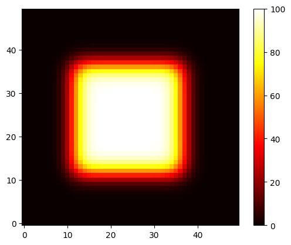

# 2D Transient Heat Conduction Solver (FDM)

 Numerical solver for the 2D transient heat equation using the explicit Finite Difference Method (FDM). 

This project demonstrates the core mathematical mechanics behind commercial thermal simulation solvers (like ANSYS Fluent), focusing on discretization accuracy and numerical stability.

## Features
* **Mathematical Discretization:** Solves the 2D parabolic partial differential equation (PDE) using central differences for spatial derivatives.
* **Hybrid Boundary Conditions:** Efficiently handles Neumann boundary conditions (insulated sides) alongside strict Dirichlet boundary overrides at the borders.
* **Numerical Efficiency:** Implements vectorized array slicing using NumPy (`T[1:-1, 1:-1]`) to eliminate nested performance-killing `for` loops.
* **Safety & Stability Governor:** Incorporates an automated stability check based on the mathematical von Neumann stability criterion to dynamically prevent solution divergence.

## Visual Output
Below is the transient temperature distribution map generated by the custom FDM solver:

## Core Technical Stack
* Language: Python 3
* Math & Numerical Arrays: NumPy
* Visualization & Animation: Matplotlib
